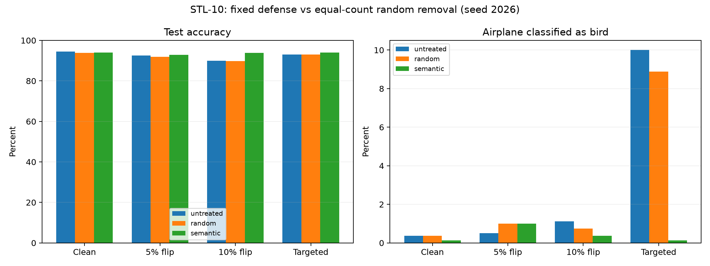

# STL-10 防御后重训练与随机删除对照

策略：仅保留 ALLOW；REVIEW/QUARANTINE 暂不进入训练，不纠正标签。检测器和阈值保持固定。
8个新模型沿用基线的 seed=2026、20 epochs、ResNet18 预训练权重及验证集选模规则。
随机对照删除相同数量图片；另用干净组衡量误隔离代价。

| 条件 | 策略 | 保留图片 | 测试准确率 | Macro-F1 | 飞机→鸟错误率 | 比未处理准确率变化 |
|---|---|---:|---:|---:|---:|---:|
| clean_subset | untreated | 4000 | 94.44% | 0.9444 | 0.375% | +0.00 pp |
| clean_subset | random | 3940 | 93.84% | 0.9384 | 0.375% | -0.60 pp |
| clean_subset | semantic | 3940 | 93.95% | 0.9395 | 0.125% | -0.49 pp |
| label_flip_05 | untreated | 4000 | 92.49% | 0.9248 | 0.500% | +0.00 pp |
| label_flip_05 | random | 3747 | 91.91% | 0.9191 | 1.000% | -0.57 pp |
| label_flip_05 | semantic | 3747 | 92.81% | 0.9279 | 1.000% | +0.33 pp |
| label_flip_10 | untreated | 4000 | 89.89% | 0.8986 | 1.125% | +0.00 pp |
| label_flip_10 | random | 3554 | 89.83% | 0.8983 | 0.750% | -0.06 pp |
| label_flip_10 | semantic | 3554 | 93.79% | 0.9378 | 0.375% | +3.90 pp |
| targeted_0_to_1 | untreated | 4000 | 93.03% | 0.9303 | 10.000% | +0.00 pp |
| targeted_0_to_1 | random | 3863 | 92.95% | 0.9296 | 8.875% | -0.07 pp |
| targeted_0_to_1 | semantic | 3863 | 94.08% | 0.9408 | 0.125% | +1.05 pp |

## 隔离代价（选择和训练冻结后，才读取真值评分）

| 条件 | 策略 | 移除投毒样本 | 误移除正常样本 | 剩余投毒样本 |
|---|---|---:|---:|---:|
| clean_subset | random | 0 | 60 | 0 |
| clean_subset | semantic | 0 | 60 | 0 |
| label_flip_05 | random | 14 | 239 | 186 |
| label_flip_05 | semantic | 200 | 53 | 0 |
| label_flip_10 | random | 48 | 398 | 352 |
| label_flip_10 | semantic | 400 | 46 | 0 |
| targeted_0_to_1 | random | 2 | 135 | 78 |
| targeted_0_to_1 | semantic | 79 | 58 | 1 |

单种子结果不能替代多次重复。随机对照匹配总删除数量，未匹配类别分布。固定轮数下删除样本会减少优化步数。
检测结果已在先前实验中观察过，本轮是固定策略的下游验证，不能描述成完全未见攻击上的最终盲测。
模型文件、输入清单、训练协议和逐样本测试指标均已核验。

