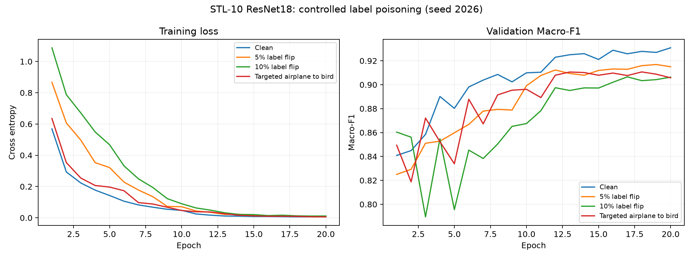

# STL-10 首轮分类模型训练结果

四组使用同一 ResNet18 预训练初始化，seed=2026，20 epochs，batch size=32。
训练/验证/测试为 4000/1000/8000，按验证集 Macro-F1 选模。
以下为下游分类模型指标，与语义投毒检测的检出率不同。

| 训练数据 | 测试准确率 | Macro-F1 | 飞机→鸟误分类率 | 最佳轮次 |
|---|---:|---:|---:|---:|
| clean_subset | 94.44% | 0.9444 | 0.38% | 20 |
| label_flip_05 | 92.49% | 0.9248 | 0.50% | 19 |
| label_flip_10 | 89.89% | 0.8986 | 1.12% | 17 |
| targeted_0_to_1 | 93.03% | 0.9303 | 10.00% | 18 |

## 解释边界

这是单个训练种子、单组固定投毒清单的首轮对照。不能据此认定投毒比例与损害严格单调。
本轮没有防御后重训练组，尚不能证明隔离可疑数据可以恢复性能。
未来重复训练应保持测试集隔离；多个训练种子只测训练随机性，投毒样本抽样随机性需单独实验。
预训练模型与 STL-10 来源可能存在重叠，不能声称完全从未见过相关图像。

已核验四组模型文件、清单哈希、20轮历史和每组8000条测试预测，准确率及定向误分类率与逐样本预测一致。

