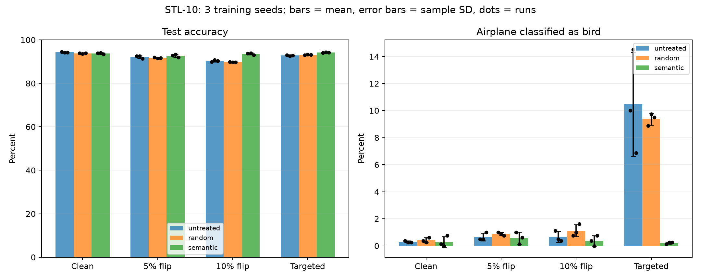

# STL-10 多训练种子重复

训练种子 2026、2027、2028；4 种数据条件 × 3 种处理策略 × 3 个种子 = 36 个模型。
2026 的 12 个模型复用既有结果，新增 24 个模型。全部模型校验输入哈希、训练协议、检查点与逐样本测试指标。
固定数据划分、投毒样本、检测器、阈值、语义隔离与随机删除清单，只改变训练随机性。每次 20 epochs，按验证集 Macro-F1 选模。
均值 ± 样本标准差（n=3，ddof=1）；不是置信区间。

| 条件 | 策略 | 测试准确率（%） | Macro-F1 | 飞机→鸟错误率（%） |
|---|---|---:|---:|---:|
| clean_subset | untreated | 94.27 ± 0.16 | 0.9427 ± 0.0015 | 0.292 ± 0.072 |
| clean_subset | random | 93.79 ± 0.16 | 0.9380 ± 0.0015 | 0.417 ± 0.191 |
| clean_subset | semantic | 93.79 ± 0.34 | 0.9379 ± 0.0033 | 0.292 ± 0.402 |
| label_flip_05 | untreated | 92.12 ± 0.64 | 0.9213 ± 0.0063 | 0.667 ± 0.289 |
| label_flip_05 | random | 91.71 ± 0.20 | 0.9170 ± 0.0021 | 0.875 ± 0.125 |
| label_flip_05 | semantic | 92.70 ± 0.69 | 0.9267 ± 0.0073 | 0.583 ± 0.439 |
| label_flip_10 | untreated | 90.32 ± 0.41 | 0.9031 ± 0.0043 | 0.667 ± 0.402 |
| label_flip_10 | random | 89.75 ± 0.07 | 0.8975 ± 0.0009 | 1.125 ± 0.451 |
| label_flip_10 | semantic | 93.55 ± 0.45 | 0.9355 ± 0.0043 | 0.375 ± 0.375 |
| targeted_0_to_1 | untreated | 92.84 ± 0.23 | 0.9283 ± 0.0025 | 10.458 ± 3.833 |
| targeted_0_to_1 | random | 93.10 ± 0.15 | 0.9310 ± 0.0015 | 9.375 ± 0.451 |
| targeted_0_to_1 | semantic | 94.17 ± 0.10 | 0.9417 ± 0.0009 | 0.208 ± 0.072 |

## 同一种子配对差值

先在每个种子内相减，再计算均值与标准差；全部单位为百分点（pp）。准确率差值正数表示提升，飞机→鸟错误率差值负数表示改善。

| 条件 | 比较 | 准确率差值均值 ± SD | 各种子准确率差值（2026 / 2027 / 2028） | 飞机→鸟错误率差值均值 ± SD |
|---|---|---:|---|---:|
| clean_subset | semantic_minus_untreated | -0.475 ± 0.256 | -0.487 / -0.212 / -0.725 | -0.000 ± 0.433 |
| clean_subset | semantic_minus_random | +0.000 ± 0.479 | +0.113 / +0.413 / -0.525 | -0.125 ± 0.217 |
| label_flip_05 | semantic_minus_untreated | +0.571 ± 0.250 | +0.325 / +0.825 / +0.562 | -0.083 ± 0.505 |
| label_flip_05 | semantic_minus_random | +0.983 ± 0.791 | +0.900 / +1.813 / +0.238 | -0.292 ± 0.402 |
| label_flip_10 | semantic_minus_untreated | +3.233 ± 0.620 | +3.900 / +3.125 / +2.675 | -0.292 ± 0.591 |
| label_flip_10 | semantic_minus_random | +3.804 ± 0.458 | +3.963 / +4.162 / +3.287 | -0.750 ± 0.331 |
| targeted_0_to_1 | semantic_minus_untreated | +1.333 ± 0.333 | +1.050 / +1.700 / +1.250 | -10.250 ± 3.826 |
| targeted_0_to_1 | semantic_minus_random | +1.071 ± 0.051 | +1.125 / +1.025 / +1.062 | -9.167 ± 0.382 |

## 结论边界

本实验衡量固定数据和固定防御选择下的训练随机性，不衡量换数据划分、重新投毒、重新随机删除带来的不确定性。
3 个种子不足以支持普遍有效或统计显著的强结论；需要结合每个种子的配对差值判断方向是否一致。
随机对照仅匹配总删除数，未匹配类别分布；固定轮数下不同训练集大小意味着不同优化步数。
干净组用于衡量误隔离代价。原有选择与阈值在本次重复前已固定，但本研究已观察过先前攻击结果。

